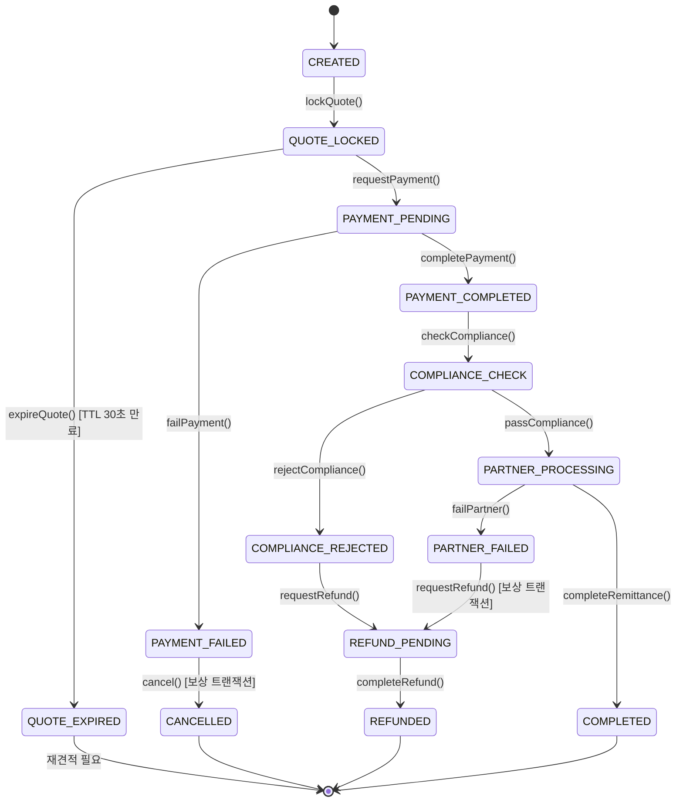

# Global Remittance Core — PRD (Product Requirements Document)

## 1. 프로젝트 개요

| 항목 | 내용 |
|------|------|
| **프로젝트명** | Global Remittance Core (Mini-PoC) |
| **목적** | 글로벌 송금 서비스의 핵심 기능을 도메인 관점에서 설계하고, **사실상 MSA와 동일한 수준**의 모듈러 모놀리스로 구현한다. Repository만 분리하면 즉시 MSA로 전환 가능한 아키텍처를 목표로 한다. |
| **아키텍처 철학** | 모듈 간 직접 호출 금지, 이벤트 기반 통신만 허용, Schema-per-Module 강제, Cross-module JOIN 불가 |

### 핵심 가치
- 확장성과 유지보수성이 높은 **이벤트 드리븐 REST API 아키텍처** 설계
- 금융/핀테크 도메인(FX)에 필수적인 **분산 환경에서의 데이터 일관성과 장애 복구 전략** 구현
- **CDC(Change Data Capture) 기반 Transactional Outbox 패턴**으로 이벤트 유실 방지
- **TDD 기반**의 신뢰할 수 있는 서버 및 테스트 자동화 파이프라인 구축

---

## 2. 기술 스택

| 분류 | 기술 |
|------|------|
| **언어 & 프레임워크** | Java 21, Spring Boot 3.x, Spring Web, Spring Data JPA, Spring Security, Spring Modulith |
| **데이터베이스** | PostgreSQL 15 (Schema-per-Module 격리) |
| **캐시 & 동시성** | Redis 7 (환율 캐싱, Redisson 분산 락) |
| **이벤트 파이프라인** | Apache Kafka, Kafka Connect, Debezium (CDC 기반 Outbox 릴레이) |
| **장애 내성** | Resilience4j (CircuitBreaker + Retry + TimeLimiter) |
| **아키텍처 검증** | Spring Modulith, ArchUnit (모듈 간 의존성 위반 CI 차단) |
| **테스트** | JUnit 5, Mockito, Spring Boot Test |
| **인프라** | Docker, Docker Compose |
| **CI/CD** | GitHub Actions |
| **모니터링** | Spring Boot Actuator, Prometheus, Grafana |

---

## 3. 시스템 아키텍처

### 3.1 모듈러 모놀리스 구조

```
┌─────────────────────────────────────────────────────────────────────┐
│                     Spring Boot Application                         │
│                                                                     │
│  ┌──────────────┐  ┌──────────────┐  ┌──────────────┐  ┌────────┐ │
│  │  User Module  │  │Payment Module│  │Remittance    │  │Partner │ │
│  │              │  │              │  │Module        │  │Module  │ │
│  │ fintech_user │  │fintech_      │  │fintech_      │  │fintech_│ │
│  │ (Schema)     │  │payment       │  │remittance    │  │partner │ │
│  │              │  │              │  │(Schema)      │  │(Schema)│ │
│  └──────┬───────┘  └──────┬───────┘  └──────┬───────┘  └───┬────┘ │
│         │                 │                 │               │      │
│         └─────────────────┴─────────────────┴───────────────┘      │
│                          │ ApplicationEvent                         │
│                          ▼                                          │
│              ┌──────────────────────┐                               │
│              │   Shared Module      │                               │
│              │  (Outbox, Events,    │                               │
│              │   Distributed Lock)  │                               │
│              └──────────┬───────────┘                               │
└─────────────────────────┼───────────────────────────────────────────┘
                          │
          ┌───────────────┼───────────────┐
          ▼               ▼               ▼
   ┌─────────────┐ ┌───────────┐ ┌──────────────┐
   │ PostgreSQL  │ │   Redis   │ │    Kafka     │
   │ (4 Schemas) │ │  (Cache   │ │ + Debezium   │
   │             │ │  + Lock)  │ │ (CDC Relay)  │
   └─────────────┘ └───────────┘ └──────────────┘
```

### 3.2 모듈 간 통신 규칙

| 규칙 | 설명 |
|------|------|
| **직접 메서드 호출 금지** | 모듈 간 `import`를 통한 직접 참조 불가. ArchUnit으로 CI에서 강제. |
| **이벤트 기반 통신만 허용** | `ApplicationEvent` 발행/구독으로만 모듈 간 데이터 교환. |
| **스키마 격리** | 각 모듈은 자기 스키마의 테이블만 직접 접근 가능. Cross-module JOIN 불가. |
| **외부 데이터 필요 시** | CQRS Read Model(이벤트 기반 스냅샷 복제)로 해결. |

### 3.3 MSA 전환 전략

현재 모듈러 모놀리스에서 MSA로 전환 시 변경 사항:

| 현재 (모듈러 모놀리스) | MSA 전환 후 |
|------------------------|-------------|
| `ApplicationEvent` | Kafka Topic 직접 발행/구독 |
| 같은 JVM 내 이벤트 전달 | 네트워크를 통한 Kafka 메시지 |
| 같은 PostgreSQL, 다른 Schema | 별도 PostgreSQL 인스턴스 |
| 같은 Docker Compose | 별도 서비스 + Kubernetes |

**전환 순서:**
1. Partner Integration 분리 (외부 의존성 격리, 독립 스케일링 필요)
2. Payment 분리 (결제 SLA 독립 보장)
3. Remittance Core 분리 (핵심 도메인 독립 배포)

---

## 4. 도메인 설계 (Bounded Contexts)

### 4.1 User & Auth Domain (`fintech_user` 스키마)

| 항목 | 내용 |
|------|------|
| **역할** | 고객 계정 관리, JWT 인증/인가, KYC 상태 관리 |
| **Aggregate Root** | `User` |
| **주요 VO** | `Email`, `Password(암호화)`, `KycStatus(PENDING, VERIFIED, REJECTED)`, `Role(CUSTOMER, ADMIN)` |
| **발행 이벤트** | `UserCreatedEvent`, `UserUpdatedEvent` |

### 4.2 Payment Domain (`fintech_payment` 스키마)

| 항목 | 내용 |
|------|------|
| **역할** | 송금을 위한 자산 Funding 및 결제 트랜잭션 처리 |
| **Aggregate Root** | `Payment` |
| **주요 VO** | `Money(amount, currency)`, `PaymentMethod`, `PaymentStatus(PENDING, COMPLETED, FAILED, REFUNDED)` |
| **발행 이벤트** | `PaymentCompletedEvent`, `PaymentFailedEvent` |
| **구독 이벤트** | `PaymentRequestedEvent` (Remittance → Payment) |

### 4.3 Remittance Domain (`fintech_remittance` 스키마) — 핵심 도메인

| 항목 | 내용 |
|------|------|
| **역할** | 환율 적용, 송금 지시, 상태 추적, 전체 오케스트레이션 |
| **Aggregate Root** | `RemittanceOrder` (상태 머신 내장) |
| **주요 VO** | `ExchangeRateSnapshot`, `Money`, `SenderId`, `ReceiverInfo`, `RemittanceStatus` |
| **CQRS 스냅샷** | `UserSnapshot(userId, displayName)` — UserCreatedEvent 구독으로 유지 |
| **발행 이벤트** | `RemittanceCreatedEvent`, `QuoteLockedEvent`, `QuoteExpiredEvent`, `PaymentRequestedEvent`, `PartnerProcessingRequestedEvent` |
| **구독 이벤트** | `PaymentCompletedEvent`, `PaymentFailedEvent`, `PartnerCompletedEvent`, `PartnerFailedEvent`, `UserCreatedEvent` |

### 4.4 Partner Integration Domain (`fintech_partner` 스키마)

| 항목 | 내용 |
|------|------|
| **역할** | 외부 해외 은행/환전 파트너사 API 통신을 격리하는 Anti-Corruption Layer(ACL) |
| **Aggregate Root** | `PartnerTransaction` |
| **주요 VO** | `PartnerStatus(PROCESSING, COMPLETED, FAILED, TIMEOUT)`, `PartnerResponse` |
| **발행 이벤트** | `PartnerCompletedEvent`, `PartnerFailedEvent` |
| **구독 이벤트** | `PartnerProcessingRequestedEvent` (Remittance → Partner) |
| **장애 내성** | Resilience4j CircuitBreaker + Retry + TimeLimiter, Configurable Mock |

---

## 5. 송금 상태 머신

### 5.1 상태 정의

| 상태 | 설명 |
|------|------|
| `CREATED` | 송금 요청 생성됨 |
| `QUOTE_LOCKED` | 환율 확정(Lock-in), TTL 30초 |
| `QUOTE_EXPIRED` | 환율 TTL 만료, 재견적 필요 |
| `PAYMENT_PENDING` | 결제 요청 중 |
| `PAYMENT_COMPLETED` | 결제 완료 |
| `PAYMENT_FAILED` | 결제 실패 |
| `COMPLIANCE_CHECK` | AML/KYC 컴플라이언스 검증 중 |
| `COMPLIANCE_REJECTED` | 컴플라이언스 검증 실패 |
| `PARTNER_PROCESSING` | 파트너사 송금 처리 중 |
| `PARTNER_FAILED` | 파트너사 처리 실패 |
| `REFUND_PENDING` | 환불 처리 중 |
| `REFUNDED` | 환불 완료 |
| `CANCELLED` | 송금 취소 |
| `COMPLETED` | 송금 완료 (최종 상태) |

### 5.2 상태 전이도



### 5.3 DDD 상태 전이 규칙

상태 전이는 **`RemittanceOrder` 엔티티 내부 메서드**에서만 수행되며, 잘못된 전이 시 `IllegalStateException`을 발생시킨다.

```java
// RemittanceOrder 엔티티 내부 예시
public void completePayment() {
    if (this.status != RemittanceStatus.PAYMENT_PENDING) {
        throw new IllegalStateException(
            "결제 완료는 PAYMENT_PENDING 상태에서만 가능합니다. 현재: " + this.status);
    }
    this.status = RemittanceStatus.PAYMENT_COMPLETED;
    registerEvent(new PaymentCompletedInternalEvent(this.id));
}
```

---

## 6. CQRS Read Model (이벤트 기반 데이터 복제)

### 6.1 설계 원칙

- 각 모듈은 다른 모듈의 테이블에 **직접 접근 불가**
- 필요한 외부 데이터는 **이벤트 구독을 통해 읽기 전용 스냅샷**으로 유지
- 복제 범위는 **최소화** (ID + 표시 정보만)

### 6.2 스냅샷 테이블

**Remittance 모듈의 UserSnapshot:**

```sql
-- fintech_remittance.user_snapshots
CREATE TABLE fintech_remittance.user_snapshots (
    user_id       UUID PRIMARY KEY,
    display_name  VARCHAR(100) NOT NULL,
    kyc_status    VARCHAR(20) NOT NULL,
    updated_at    TIMESTAMP NOT NULL
);
```

**갱신 흐름:**
```
User 모듈: UserCreatedEvent 발행
  → Outbox INSERT → Debezium → Kafka Topic
  → Remittance 모듈 Consumer: user_snapshots UPSERT
```

---

## 7. 환율 캐싱 전략

핀테크 업계 표준을 적용한 4가지 전략:

### 7.1 환율 갱신 주기

| 항목 | 값 |
|------|-----|
| **갱신 주기** | 10초 |
| **갱신 방식** | 외부 Rate Provider API 호출 → Redis 캐싱 |
| **캐시 키** | `fx:rate:{sourceCurrency}:{targetCurrency}` |
| **캐시 TTL** | 60초 (갱신 실패 시에도 일정 시간 유효) |

### 7.2 캐시 미스 Fallback

```
1차: Redis에서 캐싱된 환율 조회
2차 (미스): 마지막 유효 환율 반환 + staleness 플래그 설정
    └─ 60초 이내: 마지막 유효 환율 사용 (staleness 경고 포함)
    └─ 60초 초과: 요청 거부 (503 Service Unavailable)
```

### 7.3 환율 확정 (Lock-in)

| 항목 | 값 |
|------|-----|
| **Lock-in 시점** | 견적(Quote) 생성 시 |
| **Lock-in 방식** | `ExchangeRateSnapshot` VO에 환율 + 타임스탬프 저장 |
| **Lock-in TTL** | 30초 |
| **만료 처리** | `QUOTE_LOCKED` → `QUOTE_EXPIRED` 전이, 재견적 강제 |

### 7.4 환율 Lock-in 플로우

```
Client: POST /api/remittance/quote
  → 현재 캐싱 환율로 견적 생성
  → RemittanceOrder(CREATED → QUOTE_LOCKED)
  → ExchangeRateSnapshot 저장 (환율, 만료시각)
  → 응답: { quoteId, rate, expiresAt, estimatedAmount }

Client: POST /api/remittance/{quoteId}/confirm (30초 이내)
  → TTL 검증 → 통과 시 PAYMENT_PENDING 전이
  → TTL 만료 시 QUOTE_EXPIRED → 400 Bad Request (재견적 안내)
```

---

## 8. CDC + Transactional Outbox 파이프라인

### 8.1 아키텍처

```
┌────────────────────────────────────────────────────────────────┐
│                    Application (Spring Boot)                     │
│                                                                  │
│  @Transactional                                                  │
│  ┌─────────────────────────────────────────────────────────┐    │
│  │ 1. 비즈니스 로직 수행 (remittance_orders UPDATE)         │    │
│  │ 2. Outbox 이벤트 INSERT (outbox_events INSERT)          │    │
│  │    → 같은 트랜잭션으로 원자성 보장                        │    │
│  └─────────────────────────────────────────────────────────┘    │
└──────────────────────────┬──────────────────────────────────────┘
                           │ PostgreSQL WAL
                           ▼
              ┌─────────────────────────┐
              │   Debezium Connector    │
              │   (WAL 변경 감지)        │
              └────────────┬────────────┘
                           │
                           ▼
              ┌─────────────────────────┐
              │    Kafka Topic          │
              │  outbox.event.remittance│
              │  outbox.event.payment   │
              │  outbox.event.user      │
              │  outbox.event.partner   │
              └────────────┬────────────┘
                           │
                           ▼
              ┌─────────────────────────┐
              │   Consumer (각 모듈)     │
              │  - 멱등성 보장           │
              │    (eventId 중복 제거)   │
              │  - 실패 시 DLQ 격리      │
              └─────────────────────────┘
```

### 8.2 Outbox 테이블 스키마

각 모듈 스키마에 동일 구조의 Outbox 테이블을 배치한다:

```sql
-- 예: fintech_remittance.outbox_events
CREATE TABLE fintech_remittance.outbox_events (
    id              UUID PRIMARY KEY DEFAULT gen_random_uuid(),
    aggregate_type  VARCHAR(100) NOT NULL,  -- 'RemittanceOrder'
    aggregate_id    UUID NOT NULL,
    event_type      VARCHAR(100) NOT NULL,  -- 'PaymentRequestedEvent'
    payload         JSONB NOT NULL,
    created_at      TIMESTAMP NOT NULL DEFAULT NOW(),
    processed       BOOLEAN NOT NULL DEFAULT FALSE
);

CREATE INDEX idx_outbox_unprocessed
    ON fintech_remittance.outbox_events (processed, created_at)
    WHERE processed = FALSE;
```

### 8.3 멱등성 보장

```sql
-- 각 Consumer 모듈에 처리 완료 이벤트 추적 테이블
CREATE TABLE fintech_payment.processed_events (
    event_id      UUID PRIMARY KEY,
    processed_at  TIMESTAMP NOT NULL DEFAULT NOW()
);
```

Consumer는 이벤트 처리 전 `processed_events`에서 중복 여부를 확인하고, 이미 처리된 이벤트는 무시한다.

---

## 9. 장애 복구 전략

### 9.1 프로세스 크래시

| 전략 | 설명 |
|------|------|
| **Outbox + Debezium 자동 복구** | 프로세스가 크래시되더라도 트랜잭션이 커밋된 Outbox 이벤트는 Debezium이 WAL에서 자동 감지하여 Kafka로 전달 |
| **Stuck 상태 감지** | `@Scheduled(fixedDelay = 300_000)` Recovery Job이 5분 주기로 타임아웃된 주문 탐지 |
| **상태별 타임아웃** | `PAYMENT_PENDING` > 10분, `PARTNER_PROCESSING` > 15분 → 자동 실패 처리 + 보상 트랜잭션 |

### 9.2 네트워크 파티션

| 전략 | 설명 |
|------|------|
| **Kafka 내장 버퍼링** | 네트워크 복구 시 미전송 메시지 자동 재전송 |
| **Consumer 멱등성** | `eventId` 기반 중복 제거로 재처리 시에도 안전 |
| **DLQ (Dead Letter Queue)** | 최대 재시도(3회) 초과 시 `*.dlq` 토픽으로 격리 + 알림 |
| **수동 복구 API** | DLQ 이벤트를 재처리하는 관리 API 제공 |

### 9.3 파트너사 타임아웃

**Resilience4j 구성:**

| 컴포넌트 | 설정 |
|----------|------|
| **CircuitBreaker** | `failureRateThreshold: 50%`, `slidingWindowSize: 10`, `waitDurationInOpenState: 30s` |
| **Retry** | `maxAttempts: 3`, exponential backoff: `1s → 2s → 4s` |
| **TimeLimiter** | `timeoutDuration: 5s` |

**실패 시 보상 트랜잭션 흐름:**

```
파트너사 호출 실패 (Retry 3회 소진 or CircuitBreaker OPEN)
  → PartnerFailedEvent 발행
  → Remittance 모듈: PARTNER_PROCESSING → PARTNER_FAILED
  → 보상 트랜잭션: PARTNER_FAILED → REFUND_PENDING
  → Payment 모듈: 환불 처리
  → REFUND_PENDING → REFUNDED
```

---

## 10. 동시성 제어 (Redis 분산 락)

### 10.1 설계

| 항목 | 값 | 근거 |
|------|-----|------|
| **구현체** | Redisson | Spring Boot 생태계 표준, Watchdog 자동 연장 지원 |
| **락 키** | `remittance:account:{accountId}` | 계좌 단위 격리 (사용자가 여러 계좌 보유 가능) |
| **락 획득 실패** | 즉시 거부 + `409 Conflict` | 금융에서 대기 후 재시도는 이중 출금 위험 |
| **락 타임아웃** | 10초 | 송금 처리 최대 시간 고려 |
| **Watchdog** | 30초 기본, 작업 진행 중 자동 연장 | 장시간 처리 시 락 조기 해제 방지 |

### 10.2 Redis 선택 근거

모듈러 모놀리스(단일 JVM)에서 DB 비관적 락(`SELECT FOR UPDATE`)도 가능하지만, **Redis 분산 락을 선택한 이유:**

1. **MSA 전환 대비**: 서비스 분리 시 DB가 분산되면 단일 DB 락이 불가능
2. **DB 커넥션 점유 방지**: 비관적 락은 트랜잭션 동안 DB 커넥션을 점유하여 대규모 트래픽 시 커넥션 풀 고갈 위험
3. **일관된 인프라**: 환율 캐싱에 이미 Redis를 사용하므로 추가 인프라 비용 없음

---

## 11. 파트너사 연동

### 11.1 Anti-Corruption Layer (ACL)

외부 파트너사의 API 모델이 내부 도메인 모델을 오염시키지 않도록, Partner 모듈이 **변환 계층** 역할을 수행한다.

```
내부 도메인 이벤트 (PartnerProcessingRequestedEvent)
  → Partner 모듈: 내부 모델 → 외부 API 요청 변환
  → 외부 파트너사 API 호출 (WebClient, 비동기)
  → 외부 응답 → 내부 도메인 이벤트 변환
  → PartnerCompletedEvent 또는 PartnerFailedEvent 발행
```

### 11.2 Configurable Mock

파트너사 API를 설정 가능한 Mock으로 구현하여 장애 시나리오를 시뮬레이션한다:

| 설정 | 값 | 설명 |
|------|-----|------|
| **동작 모드** | `SUCCESS`, `FAILURE`, `TIMEOUT`, `RANDOM` | API 응답 유형 |
| **지연 시간** | 0~30초 | 응답 지연 시뮬레이션 |
| **실패 확률** | 0~100% | `RANDOM` 모드에서 실패 비율 |
| **설정 API** | `POST /api/partner/mock/config` | 런타임 동작 변경 |

---

## 12. 핵심 기능 요구사항

### 12.1 사용자 인증/인가

- Spring Security + JWT 기반 인증
- Access Token (15분) + Refresh Token (7일) 전략
- `Role(CUSTOMER, ADMIN)` 기반 API 접근 제어

### 12.2 송금 요청 생성 및 환율 Lock-in

- 수취 국가, 통화, 금액을 입력하여 송금 견적(Quote) 생성
- Redis 캐싱된 환율로 즉시 견적 응답 (지연 없음)
- 환율 Lock-in TTL 30초, 만료 시 재견적 강제

### 12.3 결제 처리 (이벤트 기반 최종 일관성)

- **격리 원칙**: Remittance 모듈과 Payment 모듈을 하나의 DB 트랜잭션으로 묶지 않음
- `PaymentRequestedEvent` → Payment 모듈 처리 → `PaymentCompletedEvent` / `PaymentFailedEvent`
- 결제 실패 시 보상 트랜잭션으로 송금 취소

### 12.4 파트너사 연동 (서킷 브레이커 + 보상 트랜잭션)

- 비동기 논블로킹 통신 (WebClient)
- Resilience4j로 장애 전파 차단
- 최종 실패 시 보상 트랜잭션: `PARTNER_FAILED` → `REFUND_PENDING` → `REFUNDED`

### 12.5 송금 상태 추적

- 고객: 자신의 송금 내역 및 실시간 상태 조회
- 상태 변경 시 이벤트 기반으로 업데이트

---

## 13. 도메인 이벤트 카탈로그

| 이벤트 | Publisher | Consumer(s) | Payload |
|--------|-----------|-------------|---------|
| `UserCreatedEvent` | User | Remittance | `{ userId, displayName, kycStatus }` |
| `UserUpdatedEvent` | User | Remittance | `{ userId, displayName, kycStatus }` |
| `RemittanceCreatedEvent` | Remittance | (Audit/Log) | `{ orderId, senderId, amount, currency }` |
| `QuoteLockedEvent` | Remittance | (Audit/Log) | `{ orderId, rate, expiresAt }` |
| `QuoteExpiredEvent` | Remittance | (Audit/Log) | `{ orderId }` |
| `PaymentRequestedEvent` | Remittance | Payment | `{ orderId, amount, currency, paymentMethod }` |
| `PaymentCompletedEvent` | Payment | Remittance | `{ orderId, paymentId, transactionRef }` |
| `PaymentFailedEvent` | Payment | Remittance | `{ orderId, paymentId, failureReason }` |
| `PartnerProcessingRequestedEvent` | Remittance | Partner | `{ orderId, partnerCode, amount, targetCurrency, receiverInfo }` |
| `PartnerCompletedEvent` | Partner | Remittance | `{ orderId, partnerTransactionId, completedAt }` |
| `PartnerFailedEvent` | Partner | Remittance | `{ orderId, partnerTransactionId, failureReason }` |

---

## 14. 데이터베이스 스키마 설계

### 14.1 스키마 분리

```sql
CREATE SCHEMA fintech_user;
CREATE SCHEMA fintech_payment;
CREATE SCHEMA fintech_remittance;
CREATE SCHEMA fintech_partner;
```

### 14.2 주요 테이블

**fintech_user:**
```sql
CREATE TABLE fintech_user.users (
    id            UUID PRIMARY KEY DEFAULT gen_random_uuid(),
    email         VARCHAR(255) UNIQUE NOT NULL,
    password_hash VARCHAR(255) NOT NULL,
    display_name  VARCHAR(100) NOT NULL,
    kyc_status    VARCHAR(20) NOT NULL DEFAULT 'PENDING',
    role          VARCHAR(20) NOT NULL DEFAULT 'CUSTOMER',
    created_at    TIMESTAMP NOT NULL DEFAULT NOW(),
    updated_at    TIMESTAMP NOT NULL DEFAULT NOW()
);
```

**fintech_remittance:**
```sql
CREATE TABLE fintech_remittance.remittance_orders (
    id                  UUID PRIMARY KEY DEFAULT gen_random_uuid(),
    sender_id           UUID NOT NULL,
    receiver_name       VARCHAR(100) NOT NULL,
    receiver_account    VARCHAR(50) NOT NULL,
    receiver_bank_code  VARCHAR(20) NOT NULL,
    receiver_country    VARCHAR(3) NOT NULL,
    source_currency     VARCHAR(3) NOT NULL,
    target_currency     VARCHAR(3) NOT NULL,
    source_amount       DECIMAL(18,2) NOT NULL,
    target_amount       DECIMAL(18,2) NOT NULL,
    exchange_rate       DECIMAL(18,8) NOT NULL,
    quote_expires_at    TIMESTAMP,
    status              VARCHAR(30) NOT NULL DEFAULT 'CREATED',
    created_at          TIMESTAMP NOT NULL DEFAULT NOW(),
    updated_at          TIMESTAMP NOT NULL DEFAULT NOW()
);

CREATE INDEX idx_remittance_sender ON fintech_remittance.remittance_orders (sender_id);
CREATE INDEX idx_remittance_status ON fintech_remittance.remittance_orders (status);
CREATE INDEX idx_remittance_created ON fintech_remittance.remittance_orders (created_at);
```

**fintech_payment:**
```sql
CREATE TABLE fintech_payment.payments (
    id                UUID PRIMARY KEY DEFAULT gen_random_uuid(),
    remittance_id     UUID NOT NULL,
    amount            DECIMAL(18,2) NOT NULL,
    currency          VARCHAR(3) NOT NULL,
    payment_method    VARCHAR(30) NOT NULL,
    status            VARCHAR(20) NOT NULL DEFAULT 'PENDING',
    transaction_ref   VARCHAR(100),
    failure_reason    TEXT,
    created_at        TIMESTAMP NOT NULL DEFAULT NOW(),
    updated_at        TIMESTAMP NOT NULL DEFAULT NOW()
);
```

**fintech_partner:**
```sql
CREATE TABLE fintech_partner.partner_transactions (
    id                      UUID PRIMARY KEY DEFAULT gen_random_uuid(),
    remittance_id           UUID NOT NULL,
    partner_code            VARCHAR(30) NOT NULL,
    partner_transaction_id  VARCHAR(100),
    amount                  DECIMAL(18,2) NOT NULL,
    currency                VARCHAR(3) NOT NULL,
    status                  VARCHAR(20) NOT NULL DEFAULT 'PROCESSING',
    failure_reason          TEXT,
    created_at              TIMESTAMP NOT NULL DEFAULT NOW(),
    updated_at              TIMESTAMP NOT NULL DEFAULT NOW()
);
```

**각 스키마 공통 — Outbox & Processed Events:**
```sql
-- Outbox (각 스키마에 동일 구조)
CREATE TABLE fintech_{module}.outbox_events (
    id              UUID PRIMARY KEY DEFAULT gen_random_uuid(),
    aggregate_type  VARCHAR(100) NOT NULL,
    aggregate_id    UUID NOT NULL,
    event_type      VARCHAR(100) NOT NULL,
    payload         JSONB NOT NULL,
    created_at      TIMESTAMP NOT NULL DEFAULT NOW(),
    processed       BOOLEAN NOT NULL DEFAULT FALSE
);

-- 멱등성 보장용 (Consumer 측 스키마에)
CREATE TABLE fintech_{module}.processed_events (
    event_id      UUID PRIMARY KEY,
    processed_at  TIMESTAMP NOT NULL DEFAULT NOW()
);
```

---

## 15. 테스트 전략

### 15.1 테스트 피라미드

```
         ┌───────────────┐
         │ Acceptance    │  시나리오 기반 인수 테스트
         │ (4 scenarios) │  Happy Path + 실패 3개
         ├───────────────┤
         │  ArchUnit     │  모듈 의존성 위반 차단
         │  (CI 필수)    │
         ├───────────────┤
         │               │
         │  Unit Tests   │  상태 전이, 환율 계산,
         │  (최다)       │  보상 트랜잭션, 이벤트 생성
         │               │
         └───────────────┘
```

### 15.2 ArchUnit 규칙

| 규칙 | 설명 |
|------|------|
| **모듈 격리** | 각 모듈 패키지는 자기 패키지 + `shared` 패키지만 참조 가능 |
| **도메인 순수성** | `domain` 패키지는 `infrastructure`, `api` 패키지 참조 불가 |
| **이벤트 통신 강제** | 모듈 간 직접 Service/Repository 참조 시 빌드 실패 |
| **JPA 엔티티 규칙** | `@Entity` 클래스는 반드시 `domain` 패키지에 위치 |

### 15.3 단위 테스트 (최다)

| 대상 | 테스트 항목 |
|------|------------|
| **RemittanceOrder 상태 전이** | 모든 유효 전이 성공, 모든 무효 전이에 `IllegalStateException` |
| **환율 계산** | 환율 적용 계산 정확성, 통화 쌍별 소수점 처리, 역환율 계산 |
| **환율 TTL** | Lock-in 생성 시 TTL 설정, 만료 판정 로직 |
| **분산 락 키 생성** | 올바른 락 키 포맷 생성 |
| **이벤트 생성** | 상태 전이 시 올바른 이벤트 타입과 페이로드 생성 |
| **보상 트랜잭션** | `PAYMENT_FAILED` → `CANCELLED`, `PARTNER_FAILED` → `REFUND_PENDING` → `REFUNDED` 전이 검증 |

### 15.4 시나리오 기반 인수 테스트

| 시나리오 | 플로우 |
|----------|--------|
| **Happy Path** | 송금 생성 → 환율 Lock-in → 결제 완료 → 컴플라이언스 통과 → 파트너 처리 → 완료 |
| **실패 1: 환율 만료** | 송금 생성 → 환율 Lock-in → 30초 경과 → `QUOTE_EXPIRED` → 재견적 |
| **실패 2: 결제 실패** | 송금 생성 → Lock-in → 결제 실패 → 보상 트랜잭션 → `CANCELLED` |
| **실패 3: 파트너 장애** | 송금 → 결제 완료 → 파트너 실패 (서킷 브레이커) → `REFUND_PENDING` → `REFUNDED` |

---

## 16. 인프라 (Docker Compose)

### 컨테이너 구성

| 컨테이너 | 이미지 | 포트 | 역할 |
|----------|--------|------|------|
| `postgres` | postgres:15 | 5432 | 4개 스키마 호스팅 |
| `redis` | redis:7 | 6379 | 환율 캐시 + 분산 락 |
| `zookeeper` | confluentinc/cp-zookeeper | 2181 | Kafka 코디네이션 |
| `kafka` | confluentinc/cp-kafka | 9092 | 이벤트 브로커 |
| `kafka-connect` | debezium/connect | 8083 | CDC 커넥터 호스팅 |
| `app` | (빌드) | 8080 | Spring Boot 애플리케이션 |

---

## 17. CI/CD (GitHub Actions)

```yaml
# 파이프라인 단계
build → ArchUnit 테스트 → 단위 테스트 → 인수 테스트 (Docker Compose)
```

| 단계 | 설명 |
|------|------|
| **Build** | `./gradlew clean build -x test` |
| **ArchUnit** | 모듈 간 의존성 위반 검증 (실패 시 즉시 중단) |
| **Unit Tests** | 도메인 로직, 상태 전이, 환율 계산 |
| **Acceptance Tests** | Docker Compose 기반 전체 인프라 구동 후 시나리오 테스트 |

---

## 18. MSA 전환 로드맵

### Phase 0: 현재 (모듈러 모놀리스)

```
단일 Spring Boot → 4개 모듈 (Schema 분리 + ApplicationEvent)
                  → CDC + Kafka (Outbox 릴레이)
                  → Redis (캐시 + 분산 락)
```

### Phase 1: Partner Integration 분리

- **근거**: 외부 의존성 격리, 서킷 브레이커 독립 스케일링
- **변경**: Partner 모듈 → 별도 Spring Boot 서비스, `fintech_partner` → 별도 DB
- **통신**: `ApplicationEvent` → Kafka Topic 직접 발행/구독

### Phase 2: Payment 분리

- **근거**: 결제 SLA 독립 보장, PCI-DSS 컴플라이언스 격리
- **변경**: Payment 모듈 → 별도 서비스, `fintech_payment` → 별도 DB

### Phase 3: Remittance Core 분리

- **근거**: 핵심 도메인 독립 배포 및 스케일링
- **변경**: Remittance 모듈 → 별도 서비스, `fintech_remittance` → 별도 DB
- **결과**: 4개 독립 마이크로서비스 + Kafka 이벤트 버스 완성
